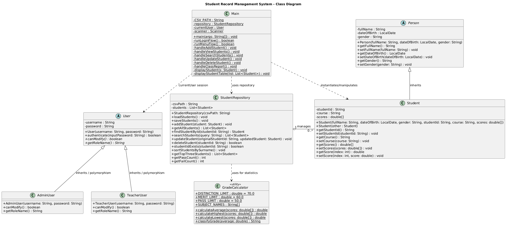
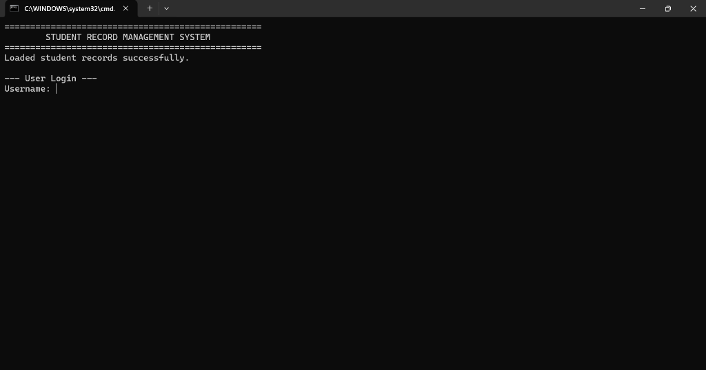
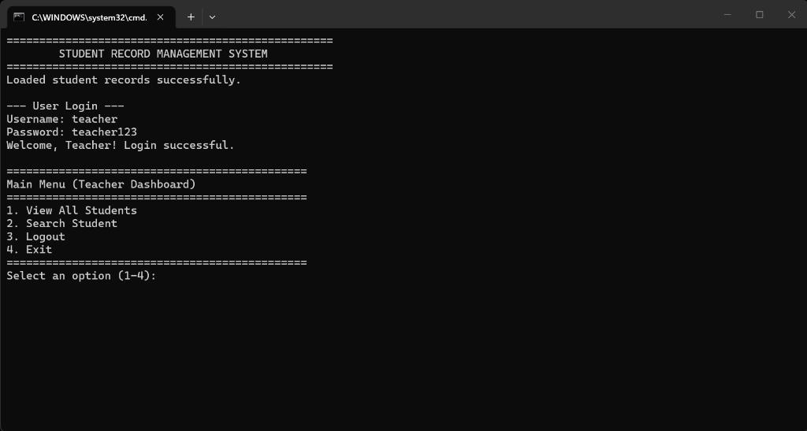
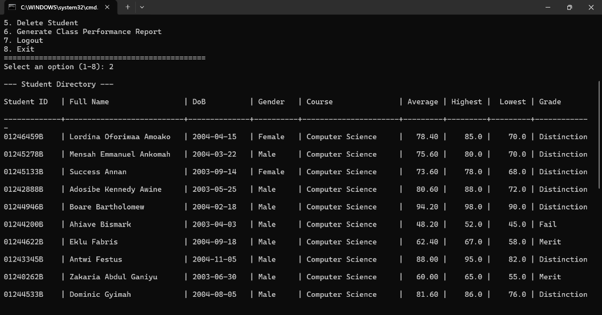
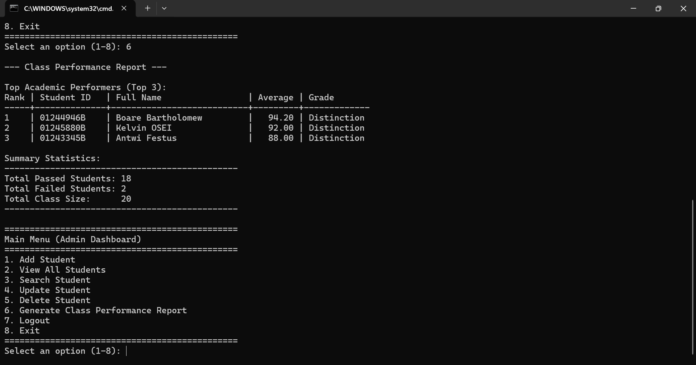

# Student Record Management System - Technical Report

## Table of Contents
1. [Introduction](#1-introduction)
2. [Objectives](#2-objectives)
3. [System Design](#3-system-design)
4. [System Implementation](#4-system-implementation)
5. [Testing](#5-testing)
6. [Conclusion](#6-conclusion)
7. [Project Contributors](#7-project-contributors)

---

## 1. Introduction

The **Student Record Management System** is a Java 11 console application our group built to help schools manage their student records better. Usually, schools keep student info on paper, which makes it really hard to find, update, or analyze things quickly. We decided to create a digital version with a simple menu to solve this problem.

With this system, admins and teachers can easily add, search, update, view, and delete student data. We also added a feature to calculate grades and statistics like the highest and lowest scores in a class. So that we don't lose data when the program closes, everything is saved into a CSV file and loaded back up when it runs again.

We made sure to use **Object-Oriented Programming (OOP) principles** like encapsulation, abstraction, inheritance, and polymorphism throughout the code.

---

## 2. Objectives

The main objective of this project was to design and implement a simple Student Record Management System that satisfies the requirements provided in the assignment.

The specific objectives are:
*   📂 To store student records digitally.
*   🚫 To prevent duplicate student IDs.
*   🔑 To provide role-based access using Administrator and Teacher accounts.
*   🖋️ To allow authorized users to add, search, update, and delete student records.
*   🧮 To calculate and display student performance statistics.
*   📊 To generate a class performance report showing the top three students together with pass and fail statistics.
*   💾 To store student records in a CSV file and automatically reload them when the application starts.
*   🧱 To demonstrate the practical application of Object-Oriented Programming concepts.

---

## 3. System Design

The application was designed using a modular Object-Oriented approach. Each class was assigned a specific responsibility, making the system easier to understand, maintain, and extend.

The project consists of eight main classes:

| Class | Responsibility |
| :--- | :--- |
| **Person** | Stores common personal information. |
| **Student** | Represents individual student records. |
| **User** | Abstract parent class for system users. |
| **AdminUser** | Represents an administrator with full system access. |
| **TeacherUser** | Represents a teacher with view and search permissions only. |
| **StudentRepository** | Handles all student record management and CSV file operations. |
| **GradeCalculator** | Performs student score calculations and grade classification. |
| **Main** | Controls the user interface, login process, and menu navigation. |

The UML Class Diagram illustrates the relationships between these classes and demonstrates how inheritance, aggregation, dependency, and polymorphism were applied throughout the project.

### Figure 1: UML Class Diagram
  
*Figure 1: UML Class Diagram of the Student Record Management System*

---

## 4. System Implementation

The application was implemented in Java 11 using a console-based interface.

*   The **`Main`** class serves as the entry point of the application. It manages user authentication, displays menus based on the user's role, validates input, and coordinates communication between the user and other classes.
*   The **`StudentRepository`** class performs all operations related to student records. These include adding, searching, updating, deleting, sorting, loading, and saving student information. Student data is stored in a CSV file to ensure persistence between program executions.
*   The **`Student`** class represents an individual student's academic record. It inherits common personal information from the `Person` class while adding student-specific information such as Student ID, course, and subject scores.
*   **User authentication** is implemented using the abstract `User` class together with the `AdminUser` and `TeacherUser` subclasses. Administrators are granted full access to the system, while teachers are restricted to viewing and searching student records.
*   The **`GradeCalculator`** utility class performs all calculations related to student performance, including average score, highest score, lowest score, and grade classification.
*   To improve software quality, extensive **input validation** was implemented throughout the application. Invalid Student IDs, duplicate IDs, invalid dates, and scores outside the accepted range are rejected before data is stored.

### Object-Oriented Programming Concepts Used
This project demonstrates the four fundamental principles of Object-Oriented Programming:

1.  **Encapsulation**: Class attributes are declared as `private` and accessed through `public` getter and setter methods. Validation logic is implemented inside constructors and setters to maintain data integrity.
2.  **Abstraction**: The `Person` and `User` classes are abstract classes that define common characteristics shared by their subclasses. They provide a blueprint without allowing direct object creation.
3.  **Inheritance**: Inheritance was implemented to reduce code duplication. The `Student` class inherits from `Person`, while `AdminUser` and `TeacherUser` inherit from `User`.
4.  **Polymorphism**: Polymorphism is demonstrated through the overridden methods `canModify()` and `getRoleName()`. These methods behave differently depending on whether the logged-in user is an Administrator or a Teacher.

---

## 5. Testing

The application was manually tested to verify that all required functionality operated correctly.

| Test Case | Expected Result / Output | Status |
| :--- | :--- | :--- |
| Administrator Login | Authenticates correct password and grants full access | **Passed** |
| Teacher Login | Authenticates correct password and grants read-only access | **Passed** |
| Three Failed Login Attempts | Terminates the application safely after 3 failures | **Passed** |
| Add Student | Accepts valid records and updates the list | **Passed** |
| Duplicate Student ID Detection | Blocks addition of records with duplicate IDs | **Passed** |
| Student ID Format Validation | Verifies format (8 digits + 1 uppercase letter) | **Passed** |
| Date Validation | Rejects invalid dates (e.g. 2026-02-30) and future dates | **Passed** |
| Score Validation | Rejects scores outside the range [0, 100] | **Passed** |
| View Students | Displays records in a formatted tabular layout | **Passed** |
| Sort by Surname | Automatically sorts records alphabetically by surname | **Passed** |
| Search by Student ID | Returns matches for exact or partial IDs | **Passed** |
| Search by Full Name | Returns matches for exact or partial names | **Passed** |
| Partial Search | Displays results matching search snippets | **Passed** |
| Update Student | Modifies fields on temporary clone before saving | **Passed** |
| Update Confirmation Prompt | Confirms save (Y/N) before committing changes | **Passed** |
| Delete Student | Removes records from the active list | **Passed** |
| Password-Protected Delete | Validates Admin password before deletion | **Passed** |
| Generate Class Report | Compiles performance reports | **Passed** |
| Top Three Students | Ranks and lists top 3 students by average | **Passed** |
| Pass/Fail Statistics | Counts passing and failing students accurately | **Passed** |
| Automatic CSV Save | Saves to students.csv immediately on modification | **Passed** |
| Automatic CSV Reload | Loads data from students.csv on startup | **Passed** |
| Teacher Permission Restrictions | Blocks modification attempts by Teacher role | **Passed** |
| Invalid Menu Input Handling | Prompts user on out-of-range options without crashing | **Passed** |

The system successfully passed all manual test cases, including additional edge-case testing involving invalid dates, duplicate student IDs, invalid score ranges, and corrupted input scenarios.

### Application Screenshots

#### Figure 2: Login Screen

#### Figure 3: Administrator Menu

#### Figure 4: Student Records

#### Figure 5: Class Performance Report

---

## 6. Conclusion

In the end, our Student Record Management System meets all the requirements given in the assignment. We managed to build a working, user-friendly app that handles student records while helping us practice real Object-Oriented Programming.

By using abstraction, encapsulation, inheritance, and polymorphism, we kept the code organized and easy to read. Adding things like input validation, user roles, and saving to a CSV file made the application much more reliable and practical.

Overall, this project was a great way to see how Java can be used to build a useful console program that actually solves a real-world problem like manual record-keeping.

---

## 7. Project Contributors

This project was developed by the following team members:

1. Lordina Oforiwaa Amoako - 01246459B
2. Eleazer Kofi Enam Tamakloe - 01240182B
3. Antwi Festus - 01243345B
4. Dey Richmond - 01242457B
5. Sowah Nicholas Okpoti Junior - 01244096B
6. Prince Ayaata Awenanyame Kwame - 01242653B
7. Eklu Fabris - 01244622B
8. Adosibe Kennedy Awine - 01242888B
9. Kelvin OSEI - 01245880B
10. Narter-Tawiah Isaac Yohanes - 01245954B
11. Mensah Emmanuel Ankomah - 01245278B
12. Zakaria Abdul Ganiyu - 01240262B
13. Dominic Gyimah - 01244533B
14. Osam Theodora - 01244733B
15. Boare Bartholomew - 01244946B
16. Darko-Ameyaw Joel - 01245244B
17. Arthur George Nana Siw - 01243019B
18. Success Annan - 01245133B
19. Darkwah Ohene Kofi Michael - 01246885B
20. Ahiave Bismark - 01244200B
